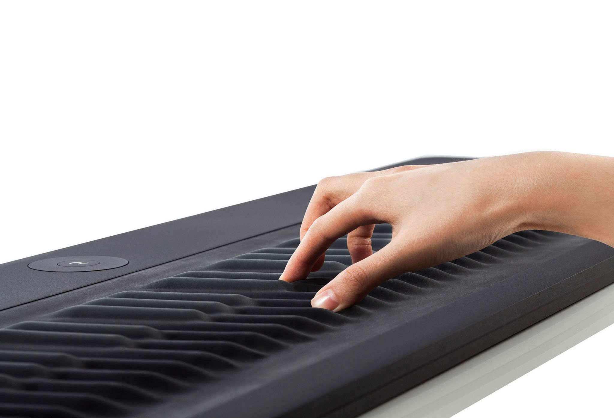
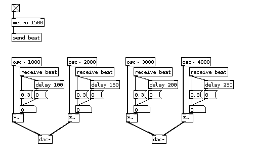

# Non-Keyboard Controllers and Laptop Music

==

### Instrument

==

### Controller
### &darr;
### Synth

==

### Controller
### &darr;
### MIDI / OSC
### &darr;
### Synth / Laptop

==

## MPC

* Released 1988
* Sampler/Sequencer
* Originally designed by Roger Linn

==

## Monome

* Released 2006
* Brian Crabtree and Kelli Cain

==

## Monome (Step Sequencer)

<iframe width="854" height="480" src="https://www.youtube.com/embed/OfFyvh_BGN8?list=PLKijC6rIacIwZKdCsHXq80rpGtKM4ZxCB" frameborder="0" allowfullscreen></iframe>

==

## More Monome

<iframe width="854" height="480" src="https://www.youtube.com/embed/kj7YScVp_a8?list=PLKijC6rIacIwZKdCsHXq80rpGtKM4ZxCB" frameborder="0" allowfullscreen></iframe>

==

## Yamaha Tenori-On

* Designed by Toshio Iwai and Yu Nishibori (Yamaha)
* Demonstrated at SIGGRAPH 2005
* Released 2007

Nishibori, Yu; Iwai, Toshio (2006). "Tenori-on". Proceedings. Int'l. Conf. on New Interfaces for Musical Expression (NIME-06). pp. 172-175.

==

<iframe width="854" height="480" src="https://www.youtube.com/embed/hzcpTMO0CrI" frameborder="0" allowfullscreen></iframe>

Notes:

* now an iOS app

==

## Novation Launchpad

* Launched in 2009
* $199

==

## Ableton Push

* Released 2012

==

<iframe src="https://player.vimeo.com/video/61997420" width="854" height="480" frameborder="0" webkitallowfullscreen mozallowfullscreen allowfullscreen></iframe>

Notes:

* notice the octave switches on big jumps, held notes stay held

==

## Buchla Thunder

==

## Snyderphonics Manta

==

## C-Thru Axis

==

## EigenHarp

<iframe width="854" height="480" src="https://www.youtube.com/embed/7TRUqFWRqIU" frameborder="0" allowfullscreen></iframe>

==

## Stribe

* From Josh Boughey (NecSys)

==

## Livid Instruments

==

## JazzMutant Lemur

* Released in 2005

Notes:

* well before the iPhone

==

## TouchOSC

==

## Haken Continuum

<iframe width="854" height="480" src="https://www.youtube.com/embed/jbJwyTkCJk0" frameborder="0" allowfullscreen></iframe>

Notes:

* Has an internal DSP
* Also sends MIDI

==

## Madrona Labs SoundPlane

<iframe width="854" height="480" src="https://www.youtube.com/embed/bUsrZlKqcW8" frameborder="0" allowfullscreen></iframe>

==

## Linnstrument

<iframe width="854" height="480" src="https://www.youtube.com/embed/5mnBx8Z5iOE" frameborder="0" allowfullscreen></iframe>

==

# Roli Seaboard

Notes:

* Can be a controller, also has an internal synth that can be programmed from a computer

==

## Silent Drum

* Jaime Oliver

<iframe width="854" height="480" src="https://www.youtube.com/embed/LTytHbZG0p8" frameborder="0" allowfullscreen></iframe>

==

## Space Palette

* uses Microsoft Kinect
* From Tim Thompson

==

<iframe width="854" height="480" src="https://www.youtube.com/embed/szJP2ZLXrr8?start=216" frameborder="0" allowfullscreen></iframe>

Notes:

* Tennis ball at 5:27 is a cool affordance demo

==

## AudioPad

<iframe width="854" height="480" src="https://www.youtube.com/embed/59zS7m23IsM" frameborder="0" allowfullscreen></iframe>

James Patten, Ben Recht, Hiroshi Ishii, "Audiopad: A tagged based Interface for Musical Performance", 2002

Notes:

* From Tangible Interfaces

==

## Reactable

<iframe width="854" height="480" src="https://www.youtube.com/embed/ltjQJz2uz2E" frameborder="0" allowfullscreen></iframe>

Sergi Jordà, Martin Kaltenbrunner, Günter Geiger, Marcos Alonso, "The reacTable: A collaborative Musical Instrument", 2004

==

## Jeff Han

* TED 2006

<iframe width="854" height="480" src="https://www.youtube.com/embed/QKh1Rv0PlOQ" frameborder="0" allowfullscreen></iframe>

==

## Laser Harp

==

## Gloves

* Elly Jessop
* Imogen Heap
* Ariana Grande

==

<iframe width="854" height="480" src="https://www.youtube.com/embed/6btFObRRD9k?start=483" frameborder="0" allowfullscreen></iframe>

==

<iframe width="854" height="480" src="https://www.youtube.com/embed/e_s6UeE-cU8" frameborder="0" allowfullscreen></iframe>

==

## Xth Sense

* Marco Donnarumma

<iframe width="854" height="480" src="https://www.youtube.com/embed/ZsMVoeJs5OA" frameborder="0" allowfullscreen></iframe>

==

## FlexiGesture

* David Merrill

<iframe width="854" height="480" src="https://www.youtube.com/embed/h2sQsSYaZE0" frameborder="0" allowfullscreen></iframe>

==

## Augmented Instruments

==

## HyperStrings

* Tod Machover

[Video Download](http://www.media.mit.edu/~joep/MPEGs/YoYo.mpg)

==

## Cuttable sensors

* Nanwei Gong, Nan Zhao

<iframe width="640" height="360" src="https://www.youtube.com/embed/JGXJK6piIZg" frameborder="0" allowfullscreen></iframe>

==

## Sensory Percussion

<iframe width="854" height="480" src="https://www.youtube.com/embed/_hgHx1iY-h4" frameborder="0" allowfullscreen></iframe>

==

## Computer Music Systems

==

## Max/MSP

Notes:

* Mention Max 4 Live

==

## Max/MSP

==

## PD

==

## SuperCollider

    // modulate a sine frequency and a noise amplitude with another sine
    // whose frequency depends on the horizontal mouse pointer position
    {
            var x = SinOsc.ar(MouseX.kr(1, 100));
            SinOsc.ar(300 * x + 800, 0, 0.1)
            +
            PinkNoise.ar(0.1 * x + 0.1)
    }.play;

==

## Overtone

    (definst sin-wave [freq 440
                        attack 0.01
                        sustain 0.4
                        release 0.1
                        vol 0.4]
      (* (env-gen (lin attack sustain release) 1 1 0 1 FREE)
         (sin-osc freq)
         vol))
    (sin-wave)

==

## CSound

#### Instrument

              instr 2
    a1        oscil     p4, p5, 1      ; p4=amp
              out       a1             ; p5=freq
              endin

==

## CSound

#### Score

    f1   0    4096 10 1      ; sine wave

    ;ins strt dur  amp(p4)   freq(p5)
    i2   0    1    2000      880
    i2   1.5  1    4000      440
    i2   3    1    8000      220
    i2   4.5  1    16000     110
    i2   6    1    32000     55

    e

==

## ChucK

      // make our patch
      SinOsc s => dac;

      // time-loop, in which the osc's frequency is changed every 100 ms
      while( true ) {
          100::ms => now;
          Std.rand2f(30.0, 1000.0) => s.freq;
      }

==

## Kyma

==

## Reaktor

